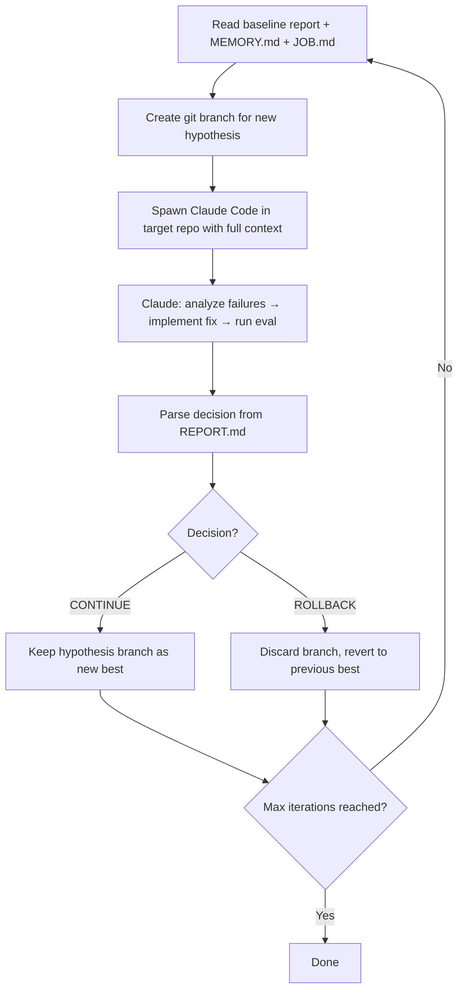

# auto-agent

A self-evolving agent optimization system that autonomously improves a target AI agent's performance through iterative, hypothesis-driven improvements. Given a golden dataset of expected input/output pairs, it runs an optimization loop — analyzing failures, implementing fixes, evaluating results, and accepting or rolling back changes — until the agent meets the desired performance bar.

## How It Works

auto-agent uses a **two-repository architecture**:

- **Orchestrator** (this repo) — controls the optimization loop, manages git branches, injects context, and tracks decisions.
- **Target agent** (separate repo) — the agent being improved. The orchestrator spawns [Claude Code](https://docs.anthropic.com/en/docs/claude-code) inside this repo to analyze and modify its code.

### The Optimization Loop



Each iteration produces a **hypothesis** — a single attempt at improvement. Claude Code receives:

- The **baseline evaluation report** (constant reference point)
- **MEMORY.md** (accumulated learnings from all prior hypotheses)
- **JOB.md** (objective, constraints, forbidden files, codebase overview)

After implementing changes and running evals, Claude fills a **REPORT.md** with metrics and a decision: `CONTINUE` (accept) or `ROLLBACK` (reject). Accepted hypotheses become the new baseline for the next iteration.

## Prerequisites

- **Node.js 22+**
- **Claude Code CLI** installed and authenticated
- **Git** available on PATH
- A **target agent repository** with an eval command that outputs JSON

## Quick Start

```bash
# 1. Clone and install
git clone <repo-url> && cd auto-agent
npm install

# 2. Create a new optimization job
npm run create-job -- --id my-job

# 3. Fill in jobs/my-job/JOB.md with your target repo details
#    (path, eval command, metrics, forbidden files, constraints)

# 4. Run the optimization loop
npm run run-job -- --id my-job
```

The system will automatically run a baseline evaluation on the first run if one doesn't exist yet.

## Scripts

| Command | Description |
|---------|-------------|
| `npm run create-job -- --id <job-id>` | Scaffold a new job folder with templates |
| `npm run run-job -- --id <job-id>` | Run the full optimization loop |
| `npm run run-job -- --id <job-id> --max-iterations 10` | Run with a custom iteration limit (default: 5) |


## Configuring a Job

After running `create-job`, edit `jobs/<job-id>/JOB.md` to configure:

| Section | Purpose |
|---------|---------|
| **Objective** | What "better" means — the specific goal for this optimization run |
| **Target Repository** | Absolute path and starting branch of the agent repo |
| **Metrics** | Primary metric to optimize + secondary constraints (regression thresholds) |
| **Scripts** | Install, build, eval, and test commands to run in the target repo |
| **Forbidden Files** | Glob patterns Claude must not modify (evals, golden dataset, etc.) |
| **Constraints** | Additional rules (model restrictions, token limits, etc.) |
| **Codebase Overview** | Map of the target repo so Claude knows where things are |
| **Golden Dataset Info** | Size, categories, and difficulty distribution |

## Key Concepts

### MEMORY.md

A shared memory file that persists across hypotheses within a job. Claude reads it at the start of each iteration and updates it after finishing. It tracks:

- **Current metrics** — accuracy, latency, cost after the latest accepted hypothesis
- **Hypothesis log** — table of all attempts with decisions and impact
- **What works** — successful patterns and strategies
- **What doesn't work** — failed approaches and why they failed
- **Known blockers** — problems that can't be solved within current constraints

This prevents the system from repeating failed strategies and helps it build on successful ones.

### REPORT.md

Each hypothesis produces a report containing:

- What was changed and why (hypothesis statement)
- Before/after metrics comparison
- Detailed failing cases (if any)
- A decision: **`CONTINUE`** (accept changes) or **`ROLLBACK`** (discard changes)

The orchestrator parses this decision to determine whether to keep the hypothesis branch or revert to the previous best.

### Git Branching

Each hypothesis runs on its own git branch created from the current best state. If a hypothesis is accepted (`CONTINUE`), its branch becomes the new best. If rejected (`ROLLBACK`), the orchestrator checks out the previous best branch. This ensures safe, reversible iteration.


## Design Principles

- **Human-triggered, machine-driven** — you start the loop; the system runs autonomously until completion.
- **Safe by default** — failed hypotheses are rolled back. The eval suite is immutable. If a decision can't be parsed, the system assumes `ROLLBACK`.
- **Bounded execution** — configurable max iterations prevent runaway costs.
- **Accumulated learning** — MEMORY.md prevents repeating mistakes across iterations and across runs.
- **Zero dependencies** — only Node.js built-ins, keeping the orchestrator minimal and auditable.
